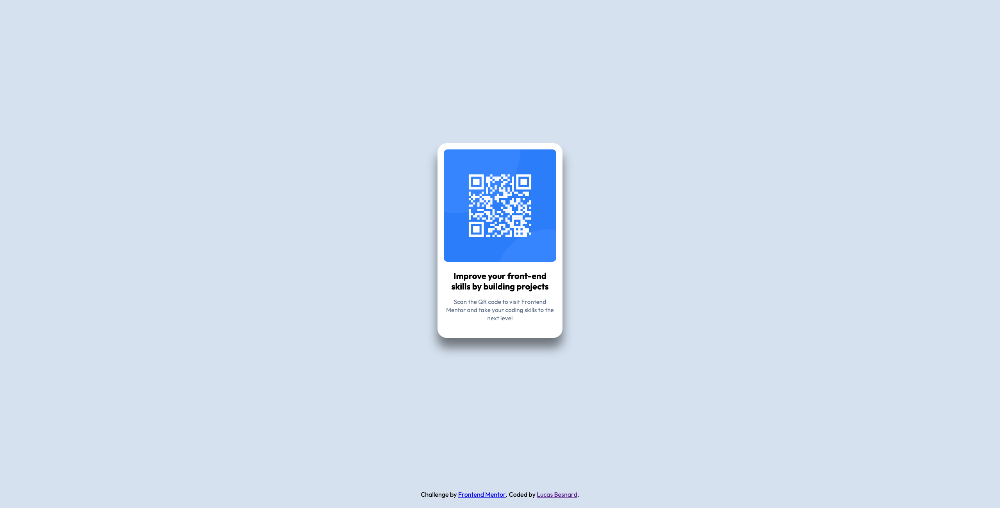

# Frontend Mentor - QR code component solution

This is a solution to the [QR code component challenge on Frontend Mentor](https://www.frontendmentor.io/challenges/qr-code-component-iux_sIO_H). Frontend Mentor challenges help you improve your coding skills by building realistic projects.

## Table of contents

- [Overview](#overview)
  - [Screenshot](#screenshot)
  - [Links](#links)
- [My process](#my-process)
  - [Built with](#built-with)
  - [What I learned](#what-i-learned)
  - [Continued development](#continued-development)
  - [Useful resources](#useful-resources)
- [Author](#author)
- [Acknowledgments](#acknowledgments)

## Overview

### Screenshot



### Links

- Solution URL: [GitHub Repository](https://github.com/LucastheFront/FM-QR-Code)
- Live Site URL: [Vercel Live Site](https://fm-qr-code-rose.vercel.app/)

## My process

### Built with

- Semantic HTML5 markup
- CSS custom properties
- CSS variables
- CSS Grid

### What I learned

I learned very interesting insights about the CSS box model when sizing the white card.
I used the intrinsic size model with `max-width: min-content` to size the card according to the width of the image element inside it.

I also used the CSS Grid Layout to center my card and put the attributions block in the bottom center.
To align the child grid item inside the area it is placed into, I used:

```css
main {
  justify-self: center;
  align-self: center;
}
```

### Continued development

I would like to deep dive into how elements are placed in the layout of the document and topics like margin collapsing.

### Useful resources

- [HTML - Web.dev](https://web.dev/learn/html/document-structure) - This helped me for the semantic HTML structure of the document.
- [CSS - Web.dev](https://web.dev/learn/css/layout) - This is an amazing resource to understand the different possibilities to align and manipulate HTML elements with CSS.

## Author

- Website - [Lucas Besnard](https://www.lucas-besnard.com)
- Frontend Mentor - [@LucastheFront](https://www.frontendmentor.io/profile/LucastheFront)
